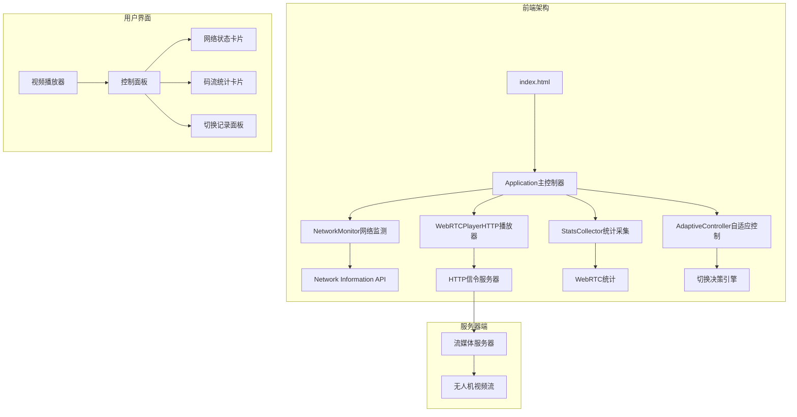

# PingTest - WebRTC 自适应码流播放器

**项目类型**: 前端 WebRTC 应用  
**技术栈**: HTML5 + JavaScript ES6 + CSS3 + WebRTC API  
**架构模式**: 模块化设计，遵循 SOLID 原则  
**生成时间**: 2025-11-02T09:59:05.000Z

## 🎯 项目愿景

这是一个专为无人机实时视频监控设计的 WebRTC 自适应码流播放器，能够根据网络状况自动调节播放质量，确保在不同网络环境下都能提供最佳的观看体验。

## 📊 架构总览



## 🏗️ 模块索引

### 核心模块

| 模块名 | 文件路径 | 职责 | 状态 |
|--------|----------|------|------|
| **主控制器** | `/js/main.js` | 整合各模块、处理UI交互 | ✅ 完整 |
| **网络监测** | `/js/network-monitor.js` | 监测网络类型、带宽、延迟 | ✅ 完整 |
| **WebRTC播放器** | `/js/webrtc-player-http.js` | 管理WebRTC连接、HTTP信令 | ✅ 完整 |
| **统计采集** | `/js/stats-collector.js` | 采集WebRTC统计数据 | ✅ 完整 |
| **自适应控制** | `/js/adaptive-controller.js` | 决策码流切换策略 | ✅ 完整 |

### 备用模块

| 模块名 | 文件路径 | 说明 | 状态 |
|--------|----------|------|------|
| **WebSocket播放器** | `/js/webrtc-player.js` | WebSocket信令版本（备用） | ⚠️ 备用 |

### 界面与样式

| 文件名 | 路径 | 说明 | 状态 |
|--------|------|------|------|
| **主页面** | `/index.html` | 应用程序入口页面 | ✅ 完整 |
| **样式系统** | `/css/style.css` | 统一UI设计系统 | ✅ 完整 |

### 文档系统

| 文件名 | 路径 | 说明 | 状态 |
|--------|------|------|------|
| **使用指南** | `/README.md` | 完整使用文档 | ✅ 完整 |
| **配置指南** | `/CONFIG.md` | 详细配置说明 | ✅ 完整 |
| **问题排查** | `/TROUBLESHOOTING.md` | 问题诊断报告 | ✅ 完整 |
| **测试报告** | `/测试报告.md` | 功能测试验证 | ✅ 完整 |

## 📋 全局规范

### 代码规范

- **模块化设计**: 每个模块单一职责，通过事件系统解耦
- **命名规范**: 使用驼峰命名法，类名首字母大写
- **注释标准**: 每个模块包含职责说明和SOLID原则应用
- **错误处理**: 统一的错误捕获和用户提示机制

### 架构原则

- **SOLID原则**: 严格遵循单一职责、开放封闭、依赖倒置等原则
- **事件驱动**: 模块间通过自定义事件系统通信
- **配置驱动**: 核心参数通过配置对象管理
- **渐进增强**: 支持Network Information API降级方案

### 技术规范

- **ES6+语法**: 使用现代JavaScript特性
- **WebRTC标准**: 严格遵循W3C WebRTC规范
- **HTTP信令**: 采用WHIP风格的HTTP POST信令协议
- **响应式设计**: 支持移动端和桌面端自适应

## 🔧 核心配置

### 流媒体服务器配置

```javascript
// 当前配置（已验证可用）
const config = {
    apiBaseUrl: 'https://glythgb.xmrbi.com/index/api/webrtc',
    streamApp: 'live',
    streamPrefix: 'stream/wrj/pri/8UUXN4R00A06RS_165-0-7',
    streamType: 'play',
    qualitySuffix: '', // 重要：服务器使用单流架构
    iceServers: [{ urls: 'stun:stun.l.google.com:19302' }]
};
```

### 自适应策略配置

```javascript
const adaptiveConfig = {
    switchCooldown: 10000,  // 切换冷却时间
    checkInterval: 3000,    // 检查间隔
    qualityThresholds: {
        '1080p': { minBandwidth: 3.0, maxRTT: 100, maxPacketLoss: 2 },
        '720p': { minBandwidth: 1.5, maxRTT: 150, maxPacketLoss: 3 },
        '480p': { minBandwidth: 0.8, maxRTT: 250, maxPacketLoss: 5 }
    }
};
```

## 🔄 数据流架构

### 网络监测流程
1. **初始化检测** → Network Information API支持检查
2. **实时监测** → 定期更新网络状态数据
3. **质量评估** → 基于带宽、延迟、网络类型评分
4. **推荐算法** → 输出最适合的分辨率建议

### WebRTC连接流程
1. **创建连接** → RTCPeerConnection初始化
2. **发送Offer** → HTTP POST到信令服务器
3. **接收Answer** → 解析服务器SDP响应
4. **ICE协商** → 建立点对点连接
5. **媒体接收** → 开始接收视频流

### 自适应控制流程
1. **数据收集** → 整合网络和WebRTC统计
2. **质量评估** → 分析当前播放质量
3. **决策算法** → 判断是否需要切换
4. **执行切换** → 调用播放器切换接口
5. **历史记录** → 记录切换原因和时间

## ⚠️ 已知限制

### 1. 多分辨率切换限制
- **原因**: 服务器使用单流架构，所有质量共享同一流ID
- **影响**: 手动切换按钮不会改变实际分辨率
- **解决**: 保持自动模式或升级服务器端架构

### 2. Network Information API兼容性
- **Chrome/Edge**: 完全支持
- **Firefox/Safari**: 部分支持，使用降级方案
- **降级策略**: 使用默认网络参数估算

## 🚀 快速启动

```bash
# 1. 进入项目目录
cd /Users/yehong/Desktop/pingtest

# 2. 启动Web服务器
python3 -m http.server 8000

# 3. 打开浏览器访问
open http://localhost:8000
```

## 📈 项目状态

- **开发状态**: ✅ 生产就绪
- **测试状态**: ✅ 全部通过
- **性能表现**: ✅ 优秀（0%丢包率，30fps流畅播放）
- **浏览器兼容**: ✅ Chrome 79+, Edge 79+, Firefox 68+, Safari 14+

## 🔮 未来扩展

1. **历史数据图表**: 添加实时性能曲线图
2. **主动带宽探测**: 增强网络质量检测准确性
3. **多源切换**: 支持多个备用流媒体源
4. **预测模型**: 基于历史数据预测网络趋势

---

**生成工具**: Claude Code init-architect  
**最后更新**: 2025-11-02T09:59:05.000Z  
**文档版本**: v1.0.0